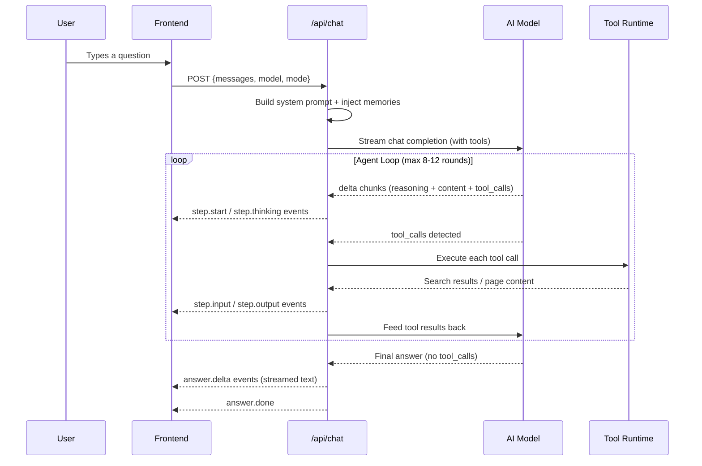
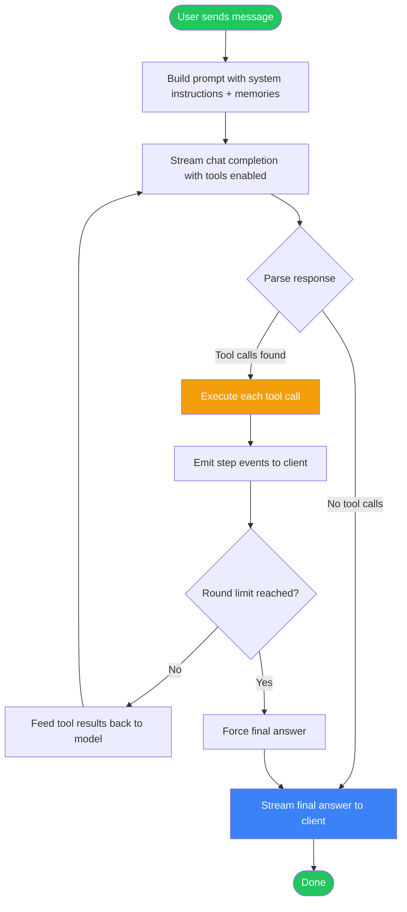
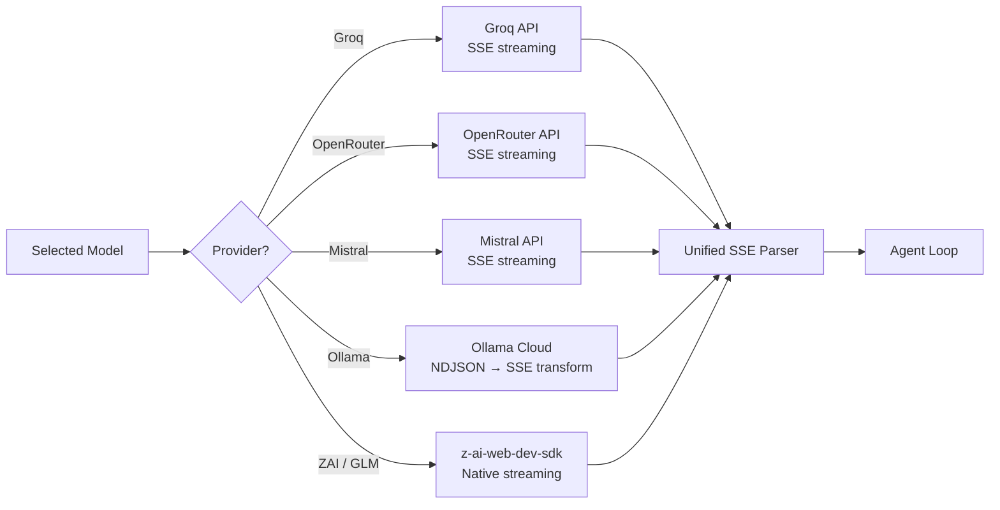
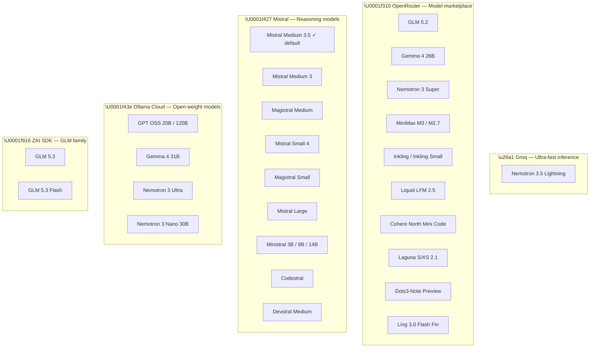
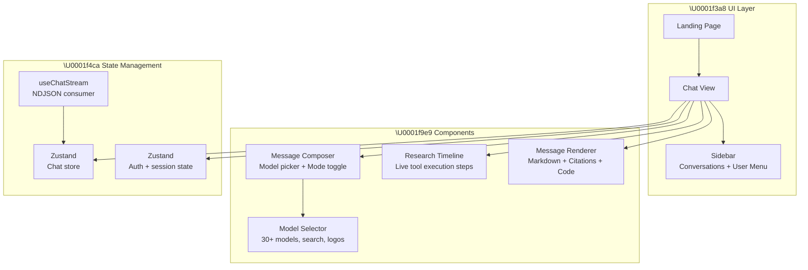

<p align="center">
  
</p>

<h1 align="center">GrayTell</h1>

<p align="center">
  <strong>Deep-research AI agent with multi-provider model routing, real-time tool calling, and streaming answers.</strong><br/>
  Ask a question → the agent searches the web, reads pages, reasons through sources, and writes a cited answer — all live.Please note that this is just an explanation of how it works nit the full thing it self . Built by Anubhav Sapkota only the founder of Graytell org .
</p>

#Social links
website : https://graytellai.space-z.ai
x : https://x.com/graytell_org
github : https://github.com/graytell_org
instagram : https://instagram.com/graytell
porfolia : anubhavsapkota.space-z.ai

## please note that we are a small startup and impersio and silencly have beeen bought by graytell . the logo is not allowed to copy same for the name and brand colour. 

<p align="center">
  <a href="#architecture">Architecture</a> ·
  <a href="#how-it-works">How It Works</a> ·
  <a href="#multi-provider-routing">Provider Routing</a> ·
  <a href="#agent-tool-loop">Agent Loop</a> ·
  <a href="#tech-stack">Tech Stack</a> ·
  <a href="#getting-started">Getting Started</a>
</p>

---

## What is GrayTell?

GrayTell is an **AI research agent** that doesn't just chat — it *investigates*. When you ask a question, the agent:

1. **Decides** which tools to use (web search, page reader, social media search, etc.)
2. **Executes** those tools in real-time — you see every step as it happens
3. **Reasons** through the gathered evidence
4. **Writes** a fully cited, structured answer

It's built as a multi-provider gateway: one chat interface that routes to **5 different AI providers** (Groq, OpenRouter, Mistral, Ollama Cloud, and ZAI), giving you access to **30+ frontier models** — all through a single unified API.


### company description

---

## Architecture

### High-Level System Diagram

```mermaid
graph TB
    subgraph Client ["\U0001f4bb Browser (React)"]
        UI[Chat UI]
        Timeline[Research Timeline]
        Composer[Message Composer]
    end

    subgraph NextJS ["\u2699\ufe0f Next.js 16 App Router"]
        ChatAPI["/api/chat (Streaming NDJSON)"]
        AgentLoop[Agent Loop]
        ProviderRouter[Provider Router]
        ToolRuntime[Tool Runtime]
    end

    subgraph Providers ["\U0001f310 AI Providers"]
        Groq[Groq API]
        OpenRouter[OpenRouter API]
        Mistral[Mistral API]
        Ollama[Ollama Cloud API]
        ZAI[ZAI SDK]
    end

    subgraph Tools ["\U0001f50d Research Tools"]
        WebSearch[Web Search]
        PageReader[Page Reader]
        RedditSearch[Reddit]
        XSearch[X / Twitter]
        GitHubSearch[GitHub]
        YouTubeSearch[YouTube]
        LinkedInSearch[LinkedIn]
        FacebookSearch[Facebook]
        InstagramSearch[Instagram]
        ThreadsSearch[Threads]
        SnapchatSearch[Snapchat]
        SiteMap[Site Map]
    end

    subgraph Data ["\U0001f4be Data Layer"]
        Prisma[(Prisma / SQLite)]
        Supabase[(Supabase Auth)]
    end

    UI -->|POST /api/chat| ChatAPI
    ChatAPI --> AgentLoop
    AgentLoop --> ProviderRouter
    AgentLoop --> ToolRuntime
    ProviderRouter --> Groq
    ProviderRouter --> OpenRouter
    ProviderRouter --> Mistral
    ProviderRouter --> Ollama
    ProviderRouter --> ZAI
    ToolRuntime --> WebSearch
    ToolRuntime --> PageReader
    ToolRuntime --> RedditSearch
    ToolRuntime --> XSearch
    ToolRuntime --> GitHubSearch
    ToolRuntime --> YouTubeSearch
    ToolRuntime --> LinkedInSearch
    ToolRuntime --> FacebookSearch
    ToolRuntime --> InstagramSearch
    ToolRuntime --> ThreadsSearch
    ToolRuntime --> SnapchatSearch
    ToolRuntime --> SiteMap
    AgentLoop --> Prisma
    ChatAPI --> Supabase
    ChatAPI -->|NDJSON events| Timeline
    ChatAPI -->|streamed text| UI
```



### Request Lifecycle



---

## How It Works

### 1. The Agent Loop

The core of GrayTell is an **agentic tool-calling loop**. Here's the flow:



- **Search mode**: Up to **8 rounds** of tool calling
- **Deep mode**: Up to **12 rounds** for thorough investigations
- Each round can execute **multiple tool calls in parallel**

### 2. Research Tools

The agent has access to **12 research tools** that it autonomously selects:

| Tool | Purpose | Sources |
|------|---------|---------|
| `exa_search` | General web search | Exa / ZAI fallback |
| `read_page` | Full page content extraction | Exa / ZAI page_reader |
| `exa_map` | Crawl a site's structure | Exa |
| `reddit_search` | Reddit posts and discussions | Reddit API / ZAI |
| `x_search` | X/Twitter posts and threads | ZAI web_search |
| `github_search` | Repositories, issues, PRs | ZAI web_search |
| `youtube_search` | Videos and channels | ZAI web_search |
| `linkedin_search` | Profiles and companies | ZAI web_search |
| `facebook_search` | Pages and profiles | ZAI web_search |
| `instagram_search` | Posts and profiles | ZAI web_search |
| `threads_search` | Threads posts | ZAI web_search |
| `snapchat_search` | Snapchat content | ZAI web_search |

The tool runtime uses a **fallback chain**: if a premium tool (e.g. Exa) isn't configured, it automatically falls back to the built-in ZAI SDK tools — so the agent **always has working tools**.

### 3. Streaming Protocol

The server sends events as **NDJSON** (one JSON object per line) to the client:

```jsonc
// Model & mode metadata
{"type": "meta", "model": "mistral-medium-latest", "mode": "deep"}

// A tool step begins
{"type": "step.start", "stepId": "s1", "tool": "exa_search", "label": "Web search"}

// The model's reasoning before calling the tool
{"type": "step.thinking", "stepId": "s1", "text": "I need to find recent information about..."}

// What queries/URLs the tool was called with
{"type": "step.input", "stepId": "s1", "queries": ["GrayTell AI research agent"]}

// The search results come back
{"type": "step.output", "stepId": "s1", "results": [{"url": "...", "title": "..."}]}

// Step complete
{"type": "step.done", "stepId": "s1"}

// Final answer streamed token by token
{"type": "answer.delta", "text": "Based on my research..."}

// Stream finished
{"type": "answer.done"}
```

The frontend renders these events in real-time: a **research timeline** shows each tool call with its status, and the **answer area** streams the final response as it's generated.

---

## Multi-Provider Routing

GrayTell doesn't lock you into one provider. The model selector exposes **30+ models** from **5 providers**, all through a single unified interface.

### Provider Dispatch



### Provider Details



### The Ollama Cloud Adapter

Ollama Cloud uses a **native NDJSON endpoint** (`/api/chat`), not the OpenAI-compatible `/v1/chat/completions`. GrayTell includes a custom **NDJSON → SSE transformer** that converts Ollama's format into the OpenAI-compatible SSE that the unified parser expects:

```
Ollama NDJSON                          OpenAI-compatible SSE
─────────────────                        ─────────────────────
{"message":{"content":"hi"},       →  data: {"choices":[{"delta":{"content":"hi"}}]}
 "done":false}                            

{"message":{},"done":true}           →  data: [DONE]
```

Tool calls are also converted — Ollama sends `arguments` as a raw object, which gets stringified to match the OpenAI format the parser expects.

### Model Gating

Models are split into two tiers:

| Tier | Access | Examples |
|------|--------|----------|
| **Free / Unlocked** | Available to all users | Mistral family, GLM 5.3/Flash, all Ollama models, all OpenRouter free models, Nemotron 3.5 Lightning on Groq |
| **Premium / Locked** | Gated access | GPT-5.6, Claude 5, Gemini 3.7, Grok 4.6, DeepSeek V4, Kimi K3 |

The `LOCKED_MODEL_IDS` set controls which models show a lock icon in the UI. This is a simple client-side gate — server-side auth can enforce it too.

---

## Frontend Architecture



### Key UI Features

- **Research Timeline** — watch the agent think, search, and read in real-time
- **Model Selector** — searchable dropdown with provider logos, model descriptions, and lock indicators
- **Streaming Markdown** — answers render as they're generated, with syntax highlighting for code
- **Citations** — inline source links from web search results
- **Conversation History** — sidebar with Today/Yesterday/Earlier grouping
- **Guest Mode** — limited daily usage without sign-in
- **Dark / Light / System theme** — respects user preference

---

## Tech Stack

| Layer | Technology |
|-------|-----------|
| **Framework** | Next.js 16 (App Router) |
| **Language** | TypeScript 5 |
| **Styling** | Tailwind CSS 4 + shadcn/ui (New York style) |
| **Icons** | Lucide React + Remix Icon |
| **State** | Zustand (client), TanStack Query (server) |
| **Database** | Prisma ORM (SQLite) |
| **Auth** | Supabase Auth (OAuth + email) |
| **AI SDK** | z-ai-web-dev-sdk (GLM family) |
| **Markdown** | react-markdown + remark-gfm + react-syntax-highlighter |
| **Animation** | Framer Motion |
| **Validation** | Zod |

---


---


## Key Design Decisions

### Why NDJSON instead of SSE for the client protocol?

NDJSON (one JSON object per line) is simpler to parse on the client than SSE with `data:` prefixes and `event:` types. The server sends clean JSON objects — the client just reads lines and parses. This avoids edge cases with SSE reconnection, multi-line data, and event type handling.

### Why a custom Ollama adapter?

Ollama Cloud's native `/api/chat` endpoint returns NDJSON, not the OpenAI-compatible SSE format that every other provider uses. Rather than maintaining two separate parsing paths in the agent loop, we wrote a **transform stream** that converts Ollama's NDJSON into OpenAI-format SSE on the fly. The agent loop only sees one format.

### Why provider-level routing instead of a unified gateway?

Each provider has subtle differences in streaming behavior, error handling, and feature support (e.g., Ollama sends tool call `arguments` as objects instead of strings). By keeping each provider's client as an independent module that normalizes to a common SSE format, we get:
- **Easy debugging** — each provider is isolated
- **Easy to add new providers** — just write a new module that returns `ReadableStream<Uint8Array>` in the SSE format
- **Graceful degradation** — if one provider is down, others still work

### Why Zustand instead of Redux?

The chat state is relatively simple and doesn't need Redux's middleware ecosystem. Zustand gives us:
- Minimal boilerplate
- No provider wrapping
- Easy persistence (conversations survive page reloads)
- Perfect for the real-time streaming use case

---

## License

apache 2.0

---

<p align="center">
  Built with Next.js, Tailwind CSS, and shadcn/ui<br/>
  <strong>GrayTell</strong> — Deep research, delivered live.
</p>
