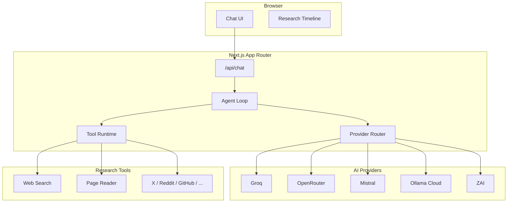

<p align="center">
  
</p>

<h1 align="center">GrayTell</h1>

<p align="center">
  <strong>Open research agent with multi-provider routing, live tool use, and full citations.</strong><br/>
  Ask a question → the agent searches, reads sources, reasons, and returns a cited answer in real time.
</p>

<p align="center">
  <a href="https://graytellai.space-z.ai">Website</a> ·
  <a href="https://x.com/GrayTell_Org">X</a> ·
  <a href="https://github.com/GrayTell">GitHub</a>
</p>

---

## What is GrayTell?

GrayTell is a research agent, not a chatbot.

When you ask a question it:

1. Decides which tools to use
2. Executes them in real time (you see every step)
3. Reasons over the evidence
4. Returns a structured answer with citations

It routes across **5 providers** and **30+ models** through a single interface, with a fallback chain so tools keep working even if a premium search provider is unavailable.

---

## Key Features

- **Agentic tool loop** — up to 8 rounds (Search mode) or 12 rounds (Deep mode), with parallel tool calls
- **12 research tools** — web search, page reader, site map, Reddit, X, GitHub, YouTube, LinkedIn, and more
- **Multi-provider routing** — Groq, OpenRouter, Mistral, Ollama Cloud, ZAI
- **Live research timeline** — watch the agent think, search, and read as it works
- **Streaming NDJSON protocol** — full visibility into every step
- **Citations by default** — every claim can be traced to a source

---

## Architecture

### High-level overview



### Agent loop

- **Search mode**: max 8 rounds
- **Deep mode**: max 12 rounds
- Multiple tool calls can run in parallel each round
- If the round limit is hit, the system forces a final answer

### Streaming protocol (NDJSON)

```jsonc
{"type": "meta", "model": "mistral-medium-latest", "mode": "deep"}
{"type": "step.start", "stepId": "s1", "tool": "exa_search", "label": "Web search"}
{"type": "step.thinking", "stepId": "s1", "text": "I need recent information about..."}
{"type": "step.input", "stepId": "s1", "queries": ["..."]}
{"type": "step.output", "stepId": "s1", "results": [...]}
{"type": "step.done", "stepId": "s1"}
{"type": "answer.delta", "text": "Based on the sources..."}
{"type": "answer.done"}
```

---

## Research Tools

| Tool              | Purpose                        | Fallback |
|-------------------|--------------------------------|----------|
| `exa_search`      | General web search             | ZAI      |
| `read_page`       | Full page content extraction   | ZAI      |
| `exa_map`         | Crawl site structure           | —        |
| `reddit_search`   | Reddit posts & discussions     | ZAI      |
| `x_search`        | X / Twitter posts & threads    | ZAI      |
| `github_search`   | Repos, issues, PRs             | ZAI      |
| `youtube_search`  | Videos & channels              | ZAI      |
| `linkedin_search` | Profiles & companies           | ZAI      |
| + others          | Facebook, Instagram, Threads, Snapchat | ZAI |

---

## Multi-Provider Routing

GrayTell does not lock you to one provider.

Supported providers:
- **Groq** — ultra-fast inference
- **OpenRouter** — broad model marketplace
- **Mistral** — strong reasoning models
- **Ollama Cloud** — open-weight models
- **ZAI** — GLM family + built-in tools

Custom adapter converts Ollama’s native NDJSON format into OpenAI-compatible SSE so the rest of the system stays uniform.

---

## Tech Stack

- **Frontend**: React + Next.js App Router
- **State**: Zustand
- **Backend**: Next.js API routes + streaming NDJSON
- **Auth / DB**: Supabase + Prisma
- **Tools**: Exa (optional) + ZAI fallback chain

---

## Getting Started

Detailed setup instructions coming soon.  
For now, see the website: [graytellai.space-z.ai](https://graytellai.space-z.ai)

---

## Status

GrayTell is early-stage and under active development.

Current focus:
- Improving citation faithfulness
- Better tool selection and error handling
- Clearer research timeline
- Open evaluation of agent reliability

We are not claiming to be a full AI safety lab yet. We are building the foundations for more transparent and verifiable research agents.

---

## Links

- Website: [graytellai.space-z.ai](https://graytellai.space-z.ai)
- X: [@GrayTell_Org](https://x.com/GrayTell_Org)
- GitHub: [github.com/GrayTell](https://github.com/GrayTell)

---

## License

Apache License 2.0
```

Copy everything above and replace the entire contents of your `README.md` with it.
